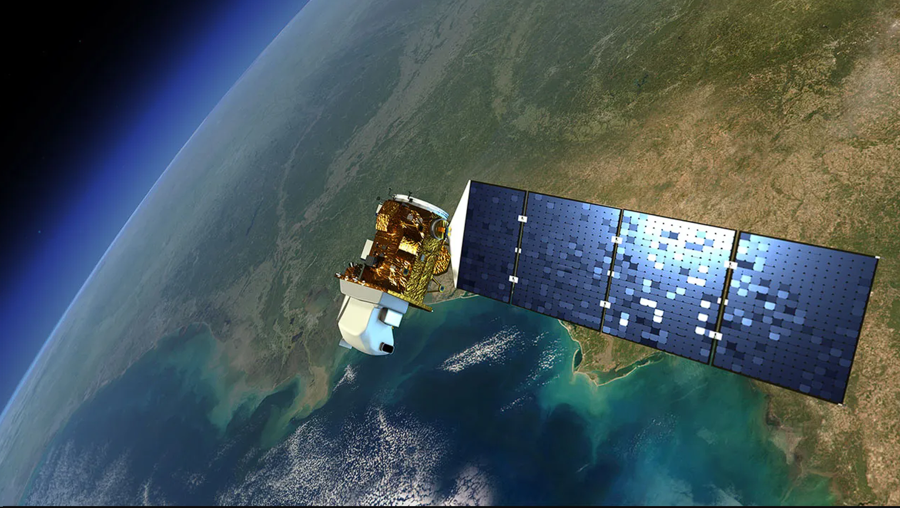

class: center, middle

# Sensor

### /ˈsɛnsə/
### a device which detects or measures a physical property and records, indicates, or otherwise responds to it.

---
# Landsat-8

* Landsat-8 is a Earth Observation Satellite launched by NASA/USGS in 2013

* The satellite carries two instruments: 

  1. Operational Land Imager (OLI)
  
  2. Thermal Infrared Sensor (TIRS) 
  
* The OLI measures in the visible, near infrared, and shortwave infrared wavelengths in 9 spectral bands (15-30m resolution) while TIRS measures and surface temperature in two thermal bands (100m resolution)

```{r,echo=FALSE, out.width="45%", fig.align="left", fig.cap="Landsat-8 in orbit"}

```
*Source: [NASA](https://science.nasa.gov/mission/landsat-8-ldcm/)*

---

# Landsat-8 Products 


---
